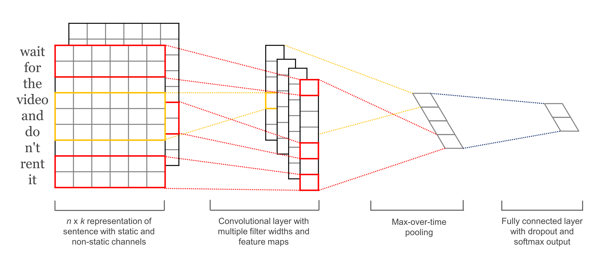
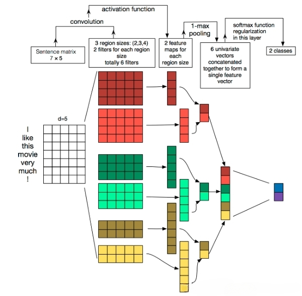
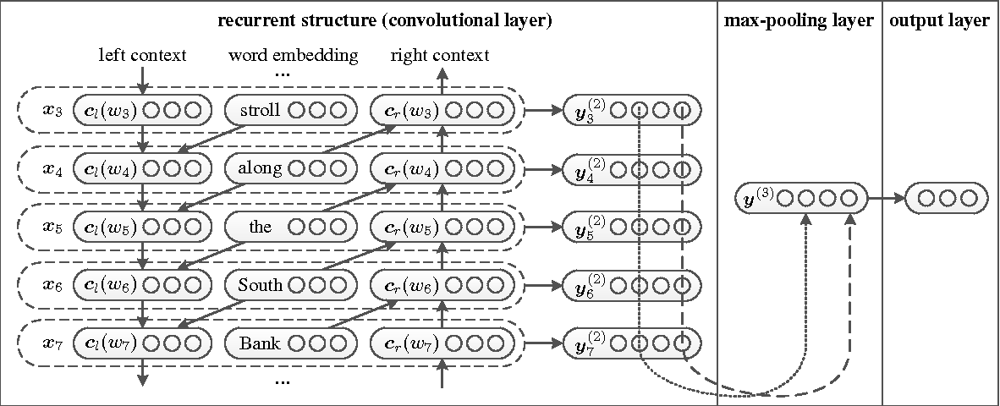
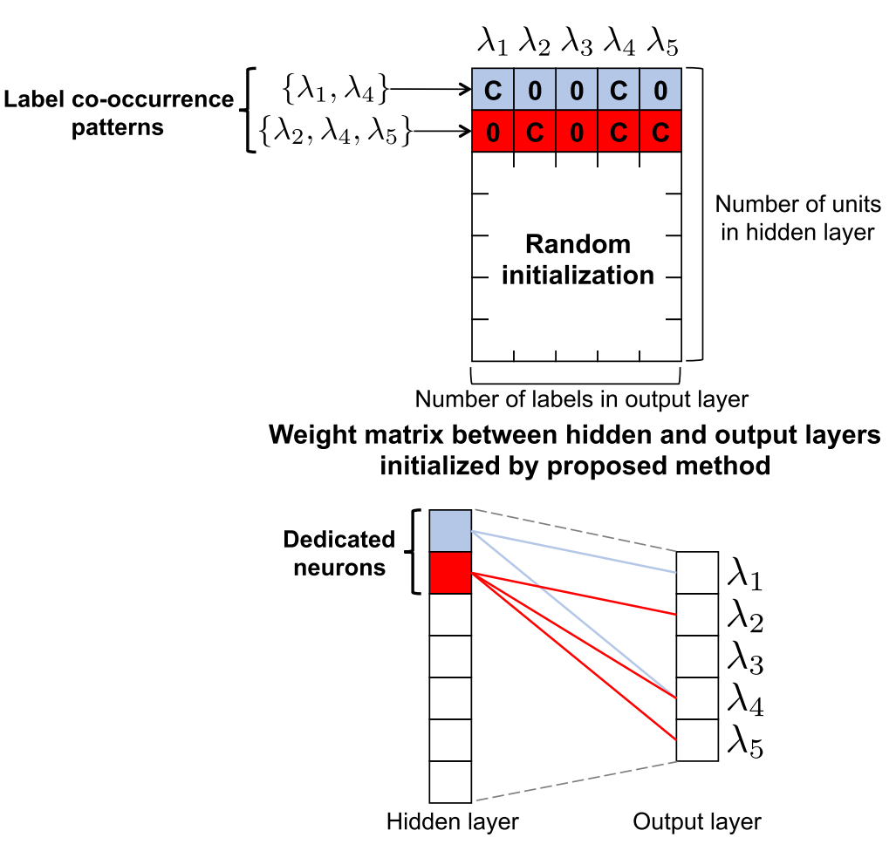

# Introduction
This project aims to give a baseline model to solve multi-label text classification task with ``Autohome'' comments data.

# Data set
The comments data is crawling from the ''Autohome'' platform and then annotated by me and my groupmates. ''Autohome'' provides users with detailed information about cars of various brands and types and users could also share their experience. The data set consists of 19,907 comments on different aspects (18 in total) varying from ''空间(space), 动力(power), 操控(control), 能耗(energy consumption), 舒适性(comfort), 外观(appearance), 内饰(interior), 性价比(cost-effective), 配置(configuration), 续航(distance till empty), 安全性(safety), 环保(environmental), 质量与可靠性(quality), 充电(charge), 服务(service), 品牌(brand), 智能驾驶(intelligent driving), 其它(other aspects)''. Since it is a multi-label classification task, **each instance is assigned to one or more labels**.

※ There may be follow-on work on this data set so it is not released as public. I only provide a sample data located in ``./data''.

# Models
* TextCNN
  
    The CNN-based model is proposed by Kim[1](#R1) and the model structure is shown as bellow. Kim use multiple convolution kernels with varying window sizes to obtain different feature maps. The author then applies a max-over-time pooling operation each feature map, which is expected to choose the most significant feature for each feature map.
    

    The below figure shows how the TextCNN model processes the example sentence ''I like this movie very much !''.
    

* TextRCNN
  
   Lai et al. propose a recurrent convolutional neural network (TextRCNN) for text classification[2](#R2) and the model's structure could be seen as below. 
   

   
   They use a bi-directional RNN as the base structure of the model and incorporate a max-pooling layer rather than average pooling into it. Most importantly, Lai et al. propose to represent a word with the combination of the word itself and its context, which could obtain a richer and more accurate word representation. The representation of word $w_i$ is defined in Equation 1:

    $$\tag{1}\mathbf{x}_i = [\mathbf{c}_l(w_i); \mathbf{e}(w_i); \mathbf{c}_r(w_i)]$$

    where $\mathbf{e}(w_i)$ denotes word embedding of $w_i$, $\mathbf{c}_l(w_i)$ and $\mathbf{c}_r(w_i)$ are the left and right contexts of word $w_i$ respectively. $\mathbf{e}(w_i)$ is a real value dense vector with $|e|$ elements. Both $\mathbf{c}_l(w_i)$) and $\mathbf{c}_r(w_i)$ are dense vectors with $|c|$ real value elements.

    The left and right contexts of word $w_i$ (i.e. $\mathbf{c}_l(w_i)$ and $\mathbf{c}_r(w_i)$) is calculated using Equation 2 and 3 respectively:
    
    $$\tag{2}\mathbf{c}_l(w_i) = f(\mathbf{W}^{(l)}\mathbf{c}_l(w_{i-1}) + \mathbf{W}^{(sl)}\mathbf{e}(w_{i-1}))$$
    
    $$\tag{3}\mathbf{c}_r(w_i) = f(\mathbf{W}^{(r)}\mathbf{c}_r(w_{i+1}) + \mathbf{W}^{(sr)}\mathbf{e}(w_{i+1}))$$

* TextRANN

    I also replace the max-pooling layer in RCNN with a self-attention module, which could also function as feature selection. 

* Label Co-occurrence initialization

    Kurata et al. propose a novel NN initialization-based method, which treats a number of neurons in the last hidden layer as dedicated neurons for each label co-occurrence pattern[3](#R3). The key idea of this NN initialization approach includes two steps. First, we should investigate the training data and find out all the label co-occurrence patterns. Then, we initialize the first $n$ rows of the weight matrix corresponding to the final hidden layer and randomly initialize the remaining rows, where $n$ is the number of label co-occurrence patterns. For each pattern corresponding to the co-occurring labels, the row is initialized in the way that the weight of elements corresponding to the co-occurring labels is a constant $C$ and the other elements are assigned a value of 0.

    

# References

[1] Yoon Kim. Convolutional neural networks for sentence classification. In Proceedings of the 2014
Conference on Empirical Methods in Natural Language Processing (EMNLP), pages 1746–1751.
Association for Computational Linguistics, oct 2014.

[2] Siwei Lai, Liheng Xu, Kang Liu, and Jun Zhao. Recurrent convolutional neural networks for text
classification. In Twenty-ninth AAAI conference on artificial intelligence, 2015.

[3]  Gakuto Kurata, Bing Xiang, and Bowen Zhou. Improved neural network-based multi-label classification with better initialization leveraging label co-occurrence. In Proceedings of the 2016 Conference
of the North American Chapter of the Association for Computational Linguistics: Human Language
Technologies, pages 521–526, 2016.

